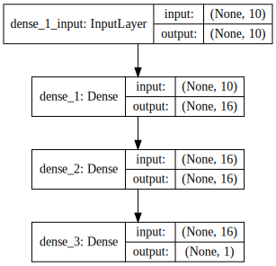

Title: Visual Neural Network Architecutre    
Slug: visual_neural_network_architecture    
Summary: How to visualize neural network architecture in Python.    
Date: 2017-09-25 12:00  
Category: Deep Learning - Keras  
Tags: Basics   
Authors: Chris Albon

## Preliminaries


```python
# Load libraries
from keras import models
from keras import layers
from IPython.display import SVG
from keras.utils.vis_utils import model_to_dot
from keras.utils import plot_model
```

    Using TensorFlow backend.


## Construct Neural Network Architecture


```python
# Start neural network
network = models.Sequential()

# Add fully connected layer with a ReLU activation function
network.add(layers.Dense(units=16, activation='relu', input_shape=(10,)))

# Add fully connected layer with a ReLU activation function
network.add(layers.Dense(units=16, activation='relu'))

# Add fully connected layer with a sigmoid activation function
network.add(layers.Dense(units=1, activation='sigmoid'))
```

## Visualize Network Architecture


```python
# Visualize network architecture
SVG(model_to_dot(network, show_shapes=True).create(prog='dot', format='svg'))
```





## Save To File


```python
# Save the visualization as a file
plot_model(network, show_shapes=True, to_file='network.png')
```
