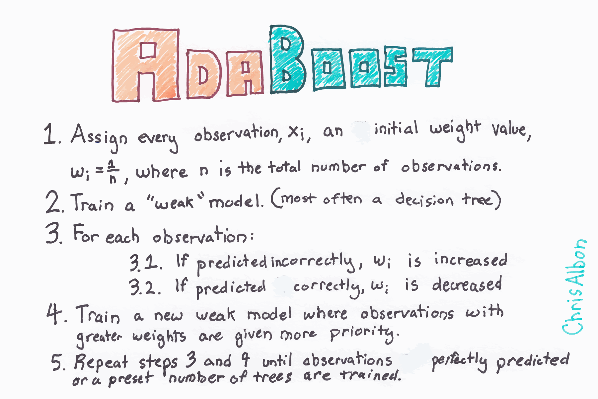

Title: Adaboost Classifier    
Slug: adaboost_classifier    
Summary: How to conduct adaboost classifier and boosting in scikit-learn for machine learning in Python.    
Date: 2017-09-18 12:00  
Category: Machine Learning  
Tags: Trees And Forests   
Authors: Chris Albon

<a alt="Adaboost" href="https://machinelearningflashcards.com">
    
</a>

## Preliminaries


```python
# Load libraries
from sklearn.ensemble import AdaBoostClassifier
from sklearn import datasets
```

## Load Iris Flower Dataset


```python
# Load data
iris = datasets.load_iris()
X = iris.data
y = iris.target
```

## Create Adaboost Classifier

The most important parameters are `base_estimator`, `n_estimators`, and `learning_rate`. 

- `base_estimator` is the learning algorithm to use to train the weak models. This will almost always not needed to be changed because by far the most common learner to use with AdaBoost is a decision tree -- this parameter's default argument. 
- `n_estimators` is the number of models to iteratively train. 
- `learning_rate` is the contribution of each model to the weights and defaults to `1`. Reducing the learning rate will mean the weights will be increased or decreased to a small degree, forcing the model train slower (but sometimes resulting in better performance scores).
- `loss` is exclusive to `AdaBoostRegressor` and sets the loss function to use when updating weights. This defaults to a linear loss function however can be changed to `square` or `exponential`.


```python
# Create adaboost-decision tree classifer object
clf = AdaBoostClassifier(n_estimators=50,
                         learning_rate=1,
                         random_state=0)
```

## Train Adaboost Classifer


```python
# Train model
model = clf.fit(X, y)
```
