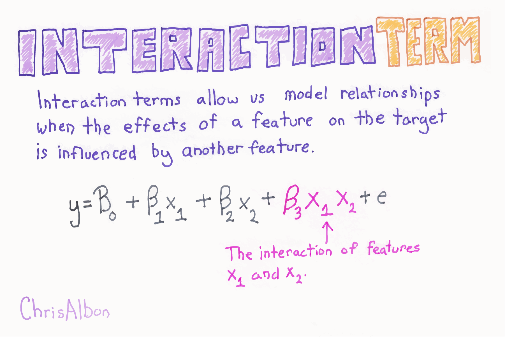

Title: Adding Interaction Terms  
Slug: adding_interaction_terms  
Summary: How to add interaction terms in scikit-learn for machine learning in Python.   
Date: 2017-09-18 12:00  
Category: Machine Learning  
Tags: Linear Regression   
Authors: Chris Albon

<a alt="Interaction Terms" href="https://machinelearningflashcards.com">
    
</a>

## Preliminaries


```python
# Load libraries
from sklearn.linear_model import LinearRegression
from sklearn.datasets import load_boston
from sklearn.preprocessing import PolynomialFeatures
import warnings

# Suppress Warning
warnings.filterwarnings(action="ignore", module="scipy", message="^internal gelsd")
```

## Load Boston Housing Dataset


```python
# Load the data with only two features
boston = load_boston()
X = boston.data[:,0:2]
y = boston.target
```

## Add Interaction Term

Interaction effects can be account for by including a new feature comprising the product of corresponding values from the interacting features: 

$$\hat y = \hat\beta_{0} + \hat\beta_{1}x_{1}+ \hat\beta_{2}x_{2} + \hat\beta_{3}x_{1}x_{2} + \epsilon$$

where $x_{1}$ and $ x_{2}$ are the values of the two features, respectively and $x_{1}x_{2}$ represents the interaction between the two. It can be useful to use scikit-learn's `PolynomialFeatures` to creative interaction terms for all combination of features. We can then use model selection strategies to identify the combination of features and interaction terms which produce the best model.


```python
# Create interaction term (not polynomial features)
interaction = PolynomialFeatures(degree=3, include_bias=False, interaction_only=True)
X_inter = interaction.fit_transform(X)
```

## Fit Linear Regression


```python
# Create linear regression
regr = LinearRegression()

# Fit the linear regression
model = regr.fit(X_inter, y)
```
