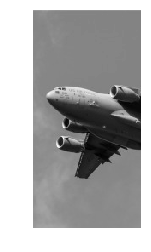

Title: Cropping Images  
Slug: cropping_images  
Summary: How to cropping images using OpenCV in Python.     
Date: 2017-09-11 12:00  
Category: Machine Learning  
Tags: Preprocessing Images    
Authors: Chris Albon

## Preliminaries


```python
# Load image
import cv2
import numpy as np
from matplotlib import pyplot as plt
```

## Load Image As Greyscale


```python
# Load image as grayscale
image = cv2.imread('images/plane_256x256.jpg', cv2.IMREAD_GRAYSCALE)
```

## Crop Image


```python
# Select first half of the columns and all rows
image_cropped = image[:,:126]
```

## View Image


```python
# View image
plt.imshow(image_cropped, cmap='gray'), plt.axis("off")
plt.show()
```




