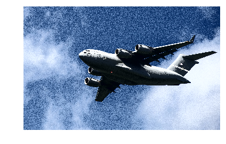

Title: Enhance Contrast Of Color Image  
Slug: enhance_contrast_of_color_image  
Summary: How to enhance the contrast of images using OpenCV in Python.     
Date: 2017-09-11 12:00  
Category: Machine Learning  
Tags: Preprocessing Images    
Authors: Chris Albon

## Preliminaries


```python
# Load image
import cv2
import numpy as np
from matplotlib import pyplot as plt
```

## Load Image


```python
# Load image
image_bgr = cv2.imread('images/plane.jpg')
```

## Convert Image To YUV Color Format


```python
# Convert to YUV
image_yuv = cv2.cvtColor(image_bgr, cv2.COLOR_BGR2YUV)
```

## Enhance Image


```python
# Apply histogram equalization
image_yuv[:, :, 0] = cv2.equalizeHist(image_yuv[:, :, 0])
```

## Convert To RGB


```python
# Convert to RGB
image_rgb = cv2.cvtColor(image_yuv, cv2.COLOR_YUV2RGB)
```

## View Image


```python
# Show image
plt.imshow(image_rgb), plt.axis("off")
plt.show()
```




