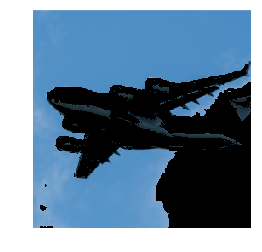

Title: Isolate Colors  
Slug: isolate_colors  
Summary: How to isolate colors in images using OpenCV in Python.     
Date: 2017-09-11 12:00  
Category: Machine Learning  
Tags: Preprocessing Images    
Authors: Chris Albon

## Preliminaries


```python
# Load image
import cv2
import numpy as np
from matplotlib import pyplot as plt
```

## Load Image


```python
# Load image
image_bgr = cv2.imread('images/plane_256x256.jpg')
```

## Convert To HSV Color Format


```python
# Convert BGR to HSV
image_hsv = cv2.cvtColor(image_bgr, cv2.COLOR_BGR2HSV)
```

## Create Mask


```python
# Define range of blue values in HSV
lower_blue = np.array([50,100,50])
upper_blue = np.array([130,255,255])

# Create mask
mask = cv2.inRange(image_hsv, lower_blue, upper_blue)
```

## Apply Mask


```python
# Mask image
image_bgr_masked = cv2.bitwise_and(image_bgr, image_bgr, mask=mask)
```

## Convert To RGB Format


```python
# Convert BGR to RGB
image_rgb = cv2.cvtColor(image_bgr_masked, cv2.COLOR_BGR2RGB)
```

## View Image


```python
# Show image
plt.imshow(image_rgb), plt.axis("off")
plt.show()
```




