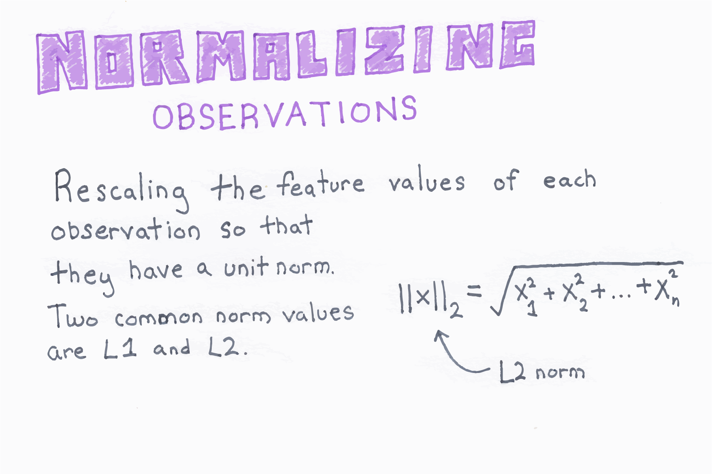

Title: Normalizing Observations  
Slug: normalizing_observations  
Summary: How to normalize observations for machine learning in Python.   
Date: 2016-09-06 12:00  
Category: Machine Learning  
Tags: Preprocessing Structured Data  
Authors: Chris Albon

<a alt="Normalizing Observations" href="https://machinelearningflashcards.com">
    
</a>

## Preliminaries


```python
# Load libraries
from sklearn.preprocessing import Normalizer
import numpy as np
```

## Create Feature Matrix


```python
# Create feature matrix
X = np.array([[0.5, 0.5], 
              [1.1, 3.4], 
              [1.5, 20.2], 
              [1.63, 34.4], 
              [10.9, 3.3]])
```

## Normalize Observations

`Normalizer` rescales the values on individual observations to have unit norm (the sum of their lengths is one). 


```python
# Create normalizer
normalizer = Normalizer(norm='l2')

# Transform feature matrix
normalizer.transform(X)
```


    array([[ 0.70710678,  0.70710678],
           [ 0.30782029,  0.95144452],
           [ 0.07405353,  0.99725427],
           [ 0.04733062,  0.99887928],
           [ 0.95709822,  0.28976368]])


