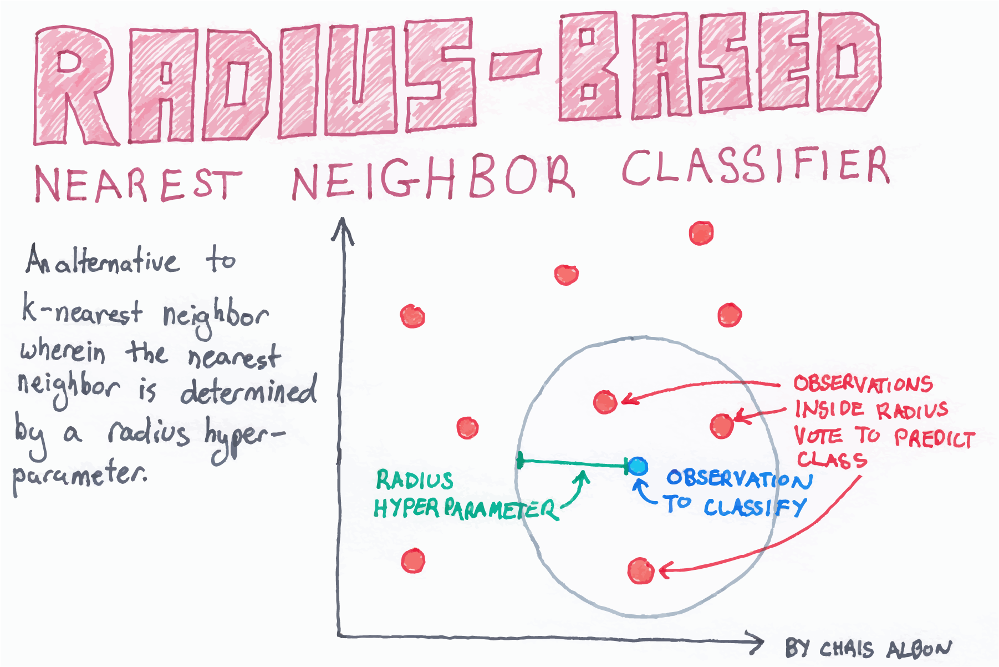

Title: Radius-Based Nearest Neighbor Classifier  
Slug: radius_based_nearest_neighbor_classifier  
Summary: Fit a radius-based nearest neighbor classifier in scikit-learn.  
Date: 2017-09-21 12:00  
Category: Machine Learning  
Tags: Nearest Neighbors  
Authors: Chris Albon  

<a alt="Radius-Based Nearest Neighbor Classifier" href="https://machinelearningflashcards.com">
    
</a>

## Preliminaries


```python
# Load libraries
from sklearn.neighbors import RadiusNeighborsClassifier
from sklearn.preprocessing import StandardScaler
from sklearn import datasets
```

## Load Iris Flower Dataset


```python
# Load data
iris = datasets.load_iris()
X = iris.data
y = iris.target
```

## Standardize Features


```python
# Create standardizer
standardizer = StandardScaler()

# Standardize features
X_std = standardizer.fit_transform(X)
```

## Fit A Radius-Based Nearest Neighbor Classifier

In scikit-learn RadiusNeighborsClassifier is very similar to KNeighborsClassifier with the exception of two parameters. First, in RadiusNeighborsClassifier we need to specify the radius of the fixed area used to determine if an observation is a neighbor using radius. Unless there is some substantive reason for setting radius to some value, it is best to treat it like any other hyperparameter and tune it during model selection. The second useful parameter is outlier_label, which indicates what label to give an observation that has no observations within the radius - which itself can often be a useful tool for identifying outliers.


```python
# Train a radius neighbors classifier
rnn = RadiusNeighborsClassifier(radius=.5, n_jobs=-1).fit(X_std, y)
```

## Predict New Observation


```python
# Create two observations
new_observations = [[ 1,  1,  1,  1]]

# Predict the class of two observations
rnn.predict(new_observations)
```


    array([2])


