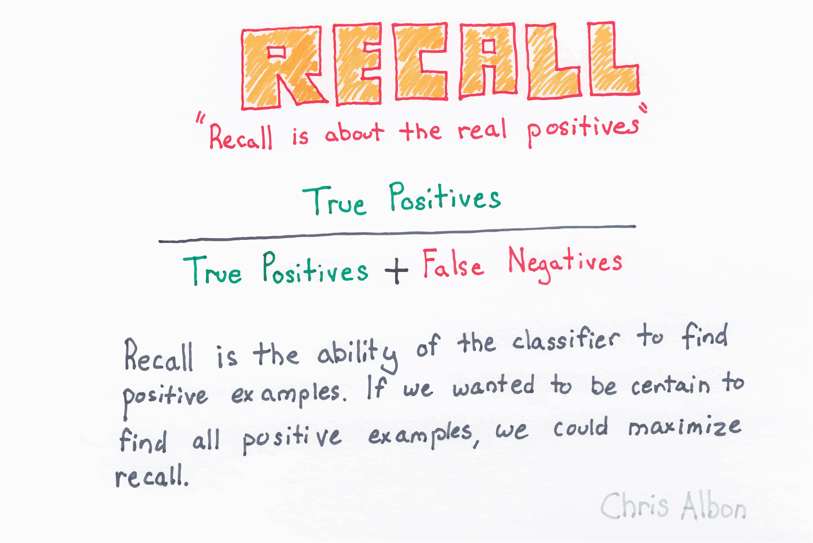

Title: Recall  
Slug: recall  
Summary: How to evaluate a Python machine learning using recall.    
Date: 2017-09-15 12:00  
Category: Machine Learning  
Tags: Model Evaluation
Authors: Chris Albon

<a alt="Recall" href="https://machinelearningflashcards.com">
    
</a>

## Preliminaries


```python
# Load libraries
from sklearn.model_selection import cross_val_score
from sklearn.linear_model import LogisticRegression
from sklearn.datasets import make_classification
```

## Generate Features And Target Data


```python
# Generate features matrix and target vector
X, y = make_classification(n_samples = 10000,
                           n_features = 3,
                           n_informative = 3,
                           n_redundant = 0,
                           n_classes = 2,
                           random_state = 1)
```

## Create Logistic Regression


```python
# Create logistic regression
logit = LogisticRegression()
```

## Cross-Validate Model Using Recall


```python
# Cross-validate model using precision
cross_val_score(logit, X, y, scoring="recall")
```


    array([ 0.95080984,  0.94961008,  0.95558223])


