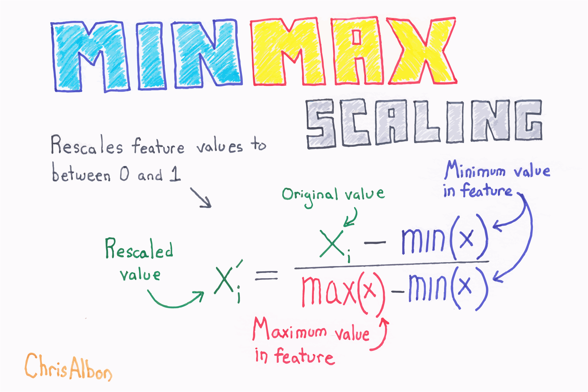

Title: Rescale A Feature  
Slug: rescale_a_feature  
Summary: How to rescale a feature for machine learning in Python.   
Date: 2016-09-06 12:00  
Category: Machine Learning  
Tags: Preprocessing Structured Data  
Authors: Chris Albon

<a alt="MinMax Scaling" href="https://machinelearningflashcards.com">
    
</a>

## Preliminaries


```python
# Load libraries
from sklearn import preprocessing
import numpy as np
```

## Create Feature


```python
# Create feature
x = np.array([[-500.5], 
              [-100.1], 
              [0], 
              [100.1], 
              [900.9]])
```

## Rescale Feature Using Min-Max


```python
# Create scaler
minmax_scale = preprocessing.MinMaxScaler(feature_range=(0, 1))

# Scale feature
x_scale = minmax_scale.fit_transform(x)

# Show feature
x_scale
```


    array([[ 0.        ],
           [ 0.28571429],
           [ 0.35714286],
           [ 0.42857143],
           [ 1.        ]])


