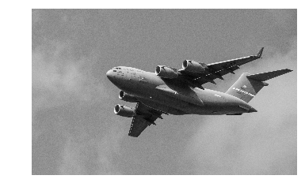

Title: Save Images  
Slug: save_images  
Summary: How to save images using OpenCV in Python.     
Date: 2017-09-11 12:00  
Category: Machine Learning  
Tags: Preprocessing Images    
Authors: Chris Albon

## Preliminaries


```python
# Load library
import cv2
import numpy as np
from matplotlib import pyplot as plt
```

## Load Image As Greyscale


```python
# Load image as grayscale
image = cv2.imread('images/plane.jpg', cv2.IMREAD_GRAYSCALE)

# Show image
plt.imshow(image, cmap='gray'), plt.axis("off")
plt.show()
```





## Save Image


```python
# Save image
cv2.imwrite('images/plane_new.jpg', image)
```


    True


