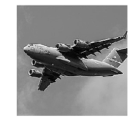

Title: Sharpen Images  
Slug: sharpen_images  
Summary: How to sharpen images using OpenCV in Python.     
Date: 2017-09-11 12:00  
Category: Machine Learning  
Tags: Preprocessing Images    
Authors: Chris Albon

## Preliminaries


```python
# Load image
import cv2
import numpy as np
from matplotlib import pyplot as plt
```

## Load Image As Greyscale


```python
# Load image as grayscale
image = cv2.imread('images/plane_256x256.jpg', cv2.IMREAD_GRAYSCALE)
```

## Sharpen Image


```python
# Create kernel
kernel = np.array([[0, -1, 0], 
                   [-1, 5,-1], 
                   [0, -1, 0]])

# Sharpen image
image_sharp = cv2.filter2D(image, -1, kernel)
```

## View Image


```python
# Show image
plt.imshow(image_sharp, cmap='gray'), plt.axis("off")
plt.show()
```




