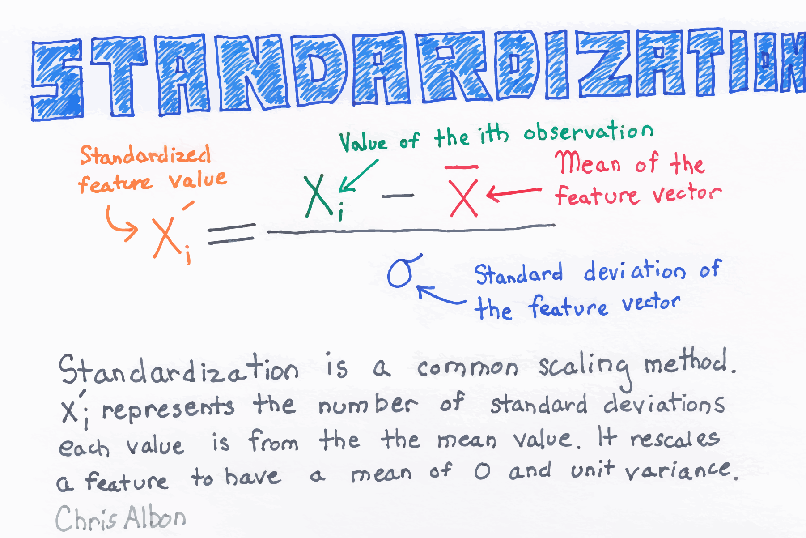

Title: Standardize A Feature  
Slug: standardize_a_feature  
Summary: How to standardize a feature for machine learning in Python.   
Date: 2016-09-06 12:00  
Category: Machine Learning  
Tags: Preprocessing Structured Data  
Authors: Chris Albon

<a alt="Standardization" href="https://machinelearningflashcards.com">
    
</a>

## Preliminaries


```python
# Load libraries
from sklearn import preprocessing
import numpy as np
```

## Create Feature


```python
# Create feature
x = np.array([[-500.5], 
              [-100.1], 
              [0], 
              [100.1], 
              [900.9]])
```

## Standardize Feature


```python
# Create scaler
scaler = preprocessing.StandardScaler()

# Transform the feature
standardized = scaler.fit_transform(x)

# Show feature
standardized
```


    array([[ 0.        ],
           [ 0.28571429],
           [ 0.35714286],
           [ 0.42857143],
           [ 1.        ]])


