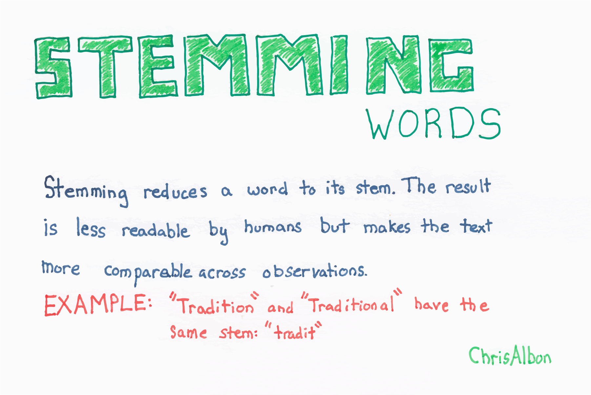

Title: Stemming Words  
Slug: stemming_words  
Summary: How to stem words in unstructured text data for machine learning in Python.   
Date: 2016-09-09 12:00  
Category: Machine Learning  
Tags: Preprocessing Text
  
Authors: Chris Albon

<a alt="Stemming Words" href="https://machinelearningflashcards.com">
    
</a>

## Preliminaries


```python
# Load library
from nltk.stem.porter import PorterStemmer
```

## Create Text Data


```python
# Create word tokens
tokenized_words = ['i', 'am', 'humbled', 'by', 'this', 'traditional', 'meeting']
```

## Stem Words

Stemming reduces a word to its stem by identifying and removing affixes (e.g. gerunds) while keeping the root meaning of the word. NLTK's `PorterStemmer` implements the widely used Porter stemming algorithm.


```python
# Create stemmer
porter = PorterStemmer()

# Apply stemmer
[porter.stem(word) for word in tokenized_words]
```


    ['i', 'am', 'humbl', 'by', 'thi', 'tradit', 'meet']


