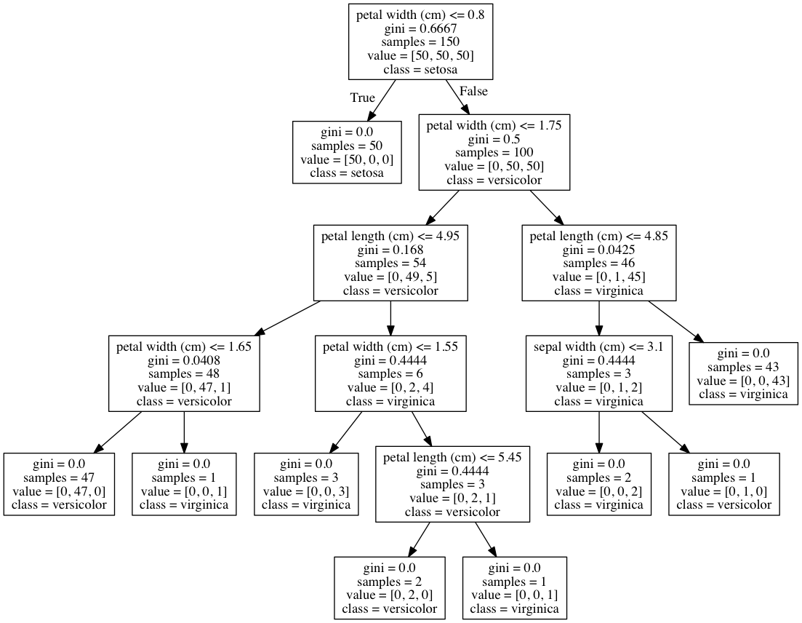

Title: Visualize A Decision Tree  
Slug: visualize_a_decision_tree  
Summary: How to visualize a decision tree regression in scikit-learn.  
Date: 2017-09-19 12:00  
Category: Machine Learning  
Tags: Trees And Forests  
Authors: Chris Albon  

## Preliminaries


```python
# Load libraries
from sklearn.tree import DecisionTreeClassifier
from sklearn import datasets
from IPython.display import Image  
from sklearn import tree
import pydotplus
```

## Load Iris Data


```python
# Load data
iris = datasets.load_iris()
X = iris.data
y = iris.target
```

## Train Decision Tree


```python
# Create decision tree classifer object
clf = DecisionTreeClassifier(random_state=0)

# Train model
model = clf.fit(X, y)
```

## Visualize Decision Tree


```python
# Create DOT data
dot_data = tree.export_graphviz(clf, out_file=None, 
                                feature_names=iris.feature_names,  
                                class_names=iris.target_names)

# Draw graph
graph = pydotplus.graph_from_dot_data(dot_data)  

# Show graph
Image(graph.create_png())
```





## Save Decision Tree Image To File


```python
# Create PDF
graph.write_pdf("iris.pdf")

# Create PNG
graph.write_png("iris.png")
```


    True


