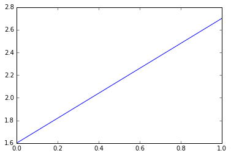

Title: Matplotlib, A Simple Example  
Slug: matplotlib_simple_example  
Summary: Matplotlib, A Simple Example  
Date: 2016-05-01 12:00  
Category: Python  
Tags: Data Visualization  
Authors: Chris Albon  

### Tell Jupyter to load matplotlib and display all visuals created inline (that is, on this page)


```python
%matplotlib inline
```

### Import matplotlib's pyplot module


```python
import matplotlib.pyplot as pyplot
```

### Create a simple plot


```python
pyplot.plot([1.6, 2.7])
```


    [<matplotlib.lines.Line2D at 0x10c4e7978>]




