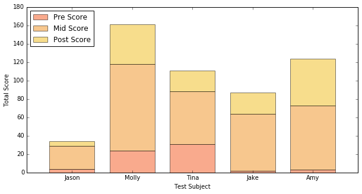

Title: Scatterplot In MatPlotLib  
Slug: matplotlib_stacked_bar_plot   
Summary: Scatterplot In MatPlotLib  
Date: 2016-05-01 12:00  
Category: Python  
Tags: Data Visualization  
Authors: Chris Albon  

Based on: [Sebastian Raschka](http://nbviewer.ipython.org/github/rasbt/matplotlib-gallery/blob/master/ipynb/barplots.ipynb).

## Preliminaries


```python
%matplotlib inline
import pandas as pd
import matplotlib.pyplot as plt
import numpy as np
```

## Create dataframe


```python
raw_data = {'first_name': ['Jason', 'Molly', 'Tina', 'Jake', 'Amy'],
        'pre_score': [4, 24, 31, 2, 3],
        'mid_score': [25, 94, 57, 62, 70],
        'post_score': [5, 43, 23, 23, 51]}
df = pd.DataFrame(raw_data, columns = ['first_name', 'pre_score', 'mid_score', 'post_score'])
df
```


<div>
<table border="1" class="dataframe">
  <thead>
    <tr style="text-align: right;">
      <th></th>
      <th>first_name</th>
      <th>pre_score</th>
      <th>mid_score</th>
      <th>post_score</th>
    </tr>
  </thead>
  <tbody>
    <tr>
      <th>0</th>
      <td>Jason</td>
      <td>4</td>
      <td>25</td>
      <td>5</td>
    </tr>
    <tr>
      <th>1</th>
      <td>Molly</td>
      <td>24</td>
      <td>94</td>
      <td>43</td>
    </tr>
    <tr>
      <th>2</th>
      <td>Tina</td>
      <td>31</td>
      <td>57</td>
      <td>23</td>
    </tr>
    <tr>
      <th>3</th>
      <td>Jake</td>
      <td>2</td>
      <td>62</td>
      <td>23</td>
    </tr>
    <tr>
      <th>4</th>
      <td>Amy</td>
      <td>3</td>
      <td>70</td>
      <td>51</td>
    </tr>
  </tbody>
</table>
</div>


## Make plot


```python
# Create the general blog and the "subplots" i.e. the bars
f, ax1 = plt.subplots(1, figsize=(10,5))

# Set the bar width
bar_width = 0.75

# positions of the left bar-boundaries
bar_l = [i+1 for i in range(len(df['pre_score']))] 

# positions of the x-axis ticks (center of the bars as bar labels)
tick_pos = [i+(bar_width/2) for i in bar_l] 

# Create a bar plot, in position bar_1
ax1.bar(bar_l, 
        # using the pre_score data
        df['pre_score'], 
        # set the width
        width=bar_width,
        # with the label pre score
        label='Pre Score', 
        # with alpha 0.5
        alpha=0.5, 
        # with color
        color='#F4561D')

# Create a bar plot, in position bar_1
ax1.bar(bar_l, 
        # using the mid_score data
        df['mid_score'], 
        # set the width
        width=bar_width,
        # with pre_score on the bottom
        bottom=df['pre_score'], 
        # with the label mid score
        label='Mid Score', 
        # with alpha 0.5
        alpha=0.5, 
        # with color
        color='#F1911E')

# Create a bar plot, in position bar_1
ax1.bar(bar_l, 
        # using the post_score data
        df['post_score'], 
        # set the width
        width=bar_width,
        # with pre_score and mid_score on the bottom
        bottom=[i+j for i,j in zip(df['pre_score'],df['mid_score'])], 
        # with the label post score
        label='Post Score', 
        # with alpha 0.5
        alpha=0.5, 
        # with color
        color='#F1BD1A')

# set the x ticks with names
plt.xticks(tick_pos, df['first_name'])

# Set the label and legends
ax1.set_ylabel("Total Score")
ax1.set_xlabel("Test Subject")
plt.legend(loc='upper left')

# Set a buffer around the edge
plt.xlim([min(tick_pos)-bar_width, max(tick_pos)+bar_width])
```


    (0.625, 6.125)




