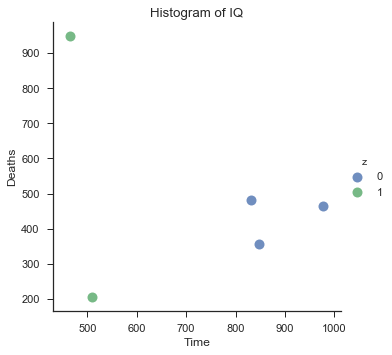

Title: Creating Scatterplots with Seaborn  
Slug: seaborn_scatterplot  
Summary: Creating Scatterplots with Seaborn  
Date: 2016-05-01 12:00  
Category: Python  
Tags: Data Visualization  
Authors: Chris Albon  

## Preliminaries


```python
import pandas as pd
%matplotlib inline
import random
import matplotlib.pyplot as plt
import seaborn as sns
```

## Create data


```python
# Create empty dataframe
df = pd.DataFrame()

# Add columns
df['x'] = random.sample(range(1, 1000), 5)
df['y'] = random.sample(range(1, 1000), 5)
df['z'] = [1,0,0,1,0]
df['k'] = ['male','male','male','female','female']
```


```python
# View first few rows of data
df.head()
```


<div>
<style>
    .dataframe thead tr:only-child th {
        text-align: right;
    }

    .dataframe thead th {
        text-align: left;
    }

    .dataframe tbody tr th {
        vertical-align: top;
    }
</style>
<table border="1" class="dataframe">
  <thead>
    <tr style="text-align: right;">
      <th></th>
      <th>x</th>
      <th>y</th>
      <th>z</th>
      <th>k</th>
    </tr>
  </thead>
  <tbody>
    <tr>
      <th>0</th>
      <td>466</td>
      <td>948</td>
      <td>1</td>
      <td>male</td>
    </tr>
    <tr>
      <th>1</th>
      <td>832</td>
      <td>481</td>
      <td>0</td>
      <td>male</td>
    </tr>
    <tr>
      <th>2</th>
      <td>978</td>
      <td>465</td>
      <td>0</td>
      <td>male</td>
    </tr>
    <tr>
      <th>3</th>
      <td>510</td>
      <td>206</td>
      <td>1</td>
      <td>female</td>
    </tr>
    <tr>
      <th>4</th>
      <td>848</td>
      <td>357</td>
      <td>0</td>
      <td>female</td>
    </tr>
  </tbody>
</table>
</div>


## Scatterplot


```python
# Set style of scatterplot
sns.set_context("notebook", font_scale=1.1)
sns.set_style("ticks")

# Create scatterplot of dataframe
sns.lmplot('x', # Horizontal axis
           'y', # Vertical axis
           data=df, # Data source
           fit_reg=False, # Don't fix a regression line
           hue="z", # Set color
           scatter_kws={"marker": "D", # Set marker style
                        "s": 100}) # S marker size

# Set title
plt.title('Histogram of IQ')

# Set x-axis label
plt.xlabel('Time')

# Set y-axis label
plt.ylabel('Deaths')
```


    <matplotlib.text.Text at 0x112b7bb70>




